  

## 📌 About Me
- 👋 Hi there! I'm Akash Vishwakarma...!!!
- I am a final-year Computer Science Engineering student specializing in Artificial Intelligence and Machine Learning. I spend most of my time in the computer lab turning complex data into actionable insights and sharpening my logic for the next big coding challenge.
- 🤝 I’m looking for help with: Efficient model deployment strategies and optimizing inference latency for large-scale AI applications.
- 🌱 I’m currently learning: Advanced Python for AI/ML and refining my competitive programming logic for upcoming technical interviews and coding challenges.
- ⚡ Fun fact: My code usually works on the first try... in my dreams. In reality, I’m a professional "Trial and Error" enthusiast.

## 🧠 My Focus Areas
- Software Engineering
- Full Stack Web Developement
- AI/ML
- Open Source Contributions

## 📊 GitHub Stats & Trophies

  
  

  

  

  

## 🛠️ Languages & Tools

> ## Programming Languages

  

> ## Frontend

    

> ## Backend

 

> ## Database

   

> ## DevOps & Cloud

    

> ## Tools

  

  

## 🔗 Connect with Me

     

  

  

